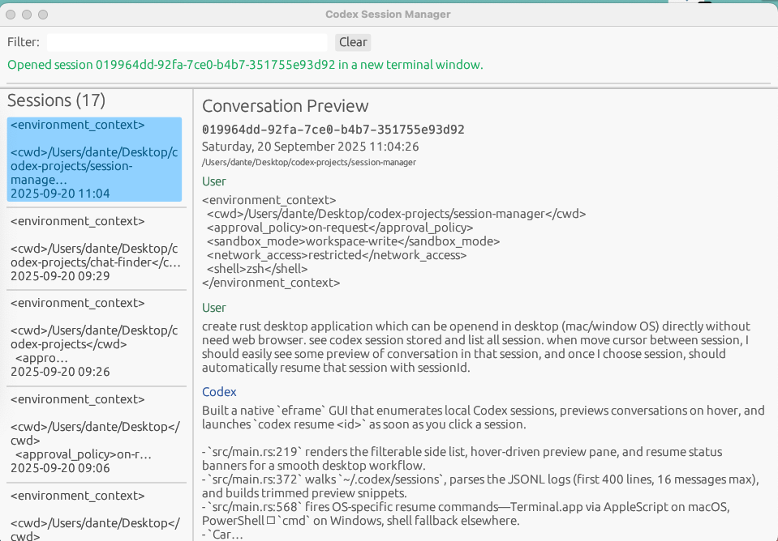

# Codex Session Manager

A cross-platform desktop viewer for Codex CLI sessions written in Rust using `egui`/`eframe`. The
app scans `~/.codex/sessions`, shows a searchable list of recorded sessions, previews messages as you
hover entries, and launches `codex resume <session-id>` in a new terminal window when you click a
session.

## Features
- Native window (macOS & Windows) built with `eframe`
- Automatically discovers Codex sessions stored under `~/.codex/sessions`
- Search box filters by session id, prompt text, cwd, and more
- Hovering a session instantly previews the opening conversation turns
- Clicking a session spawns `codex resume <id>` in a new terminal (Terminal.app on macOS,
  PowerShell/Command Prompt on Windows)

## Prerequisites
- Rust toolchain (Rust 1.75+ recommended) with `cargo`
- Codex CLI installed and available on your `PATH`

## Running
```bash
cargo run --release
```

On macOS the app uses AppleScript to open Terminal.app and run the resume command. On Windows it
invokes PowerShell to launch a new `cmd.exe` window. Ensure the Codex CLI binary is discoverable from
those shells.

## Example screenshot


## Packaging
For distribution, use the platform packaging guides for `eframe` applications (e.g., `cargo bundle`
or platform-native bundlers). The project currently focuses on development builds.

## Limitations
- Session parsing stops after the first ~400 log lines and shows up to 16 messages per session to
  keep previews responsive.
- Linux support is best-effort: the app will still run but falls back to launching `codex resume`
  via `sh -c`. No guarantee is made about terminal availability.
- The application reads from the local Codex session log directory. If you store sessions elsewhere,
  update `codex_sessions_dir()` in `src/main.rs` accordingly.
